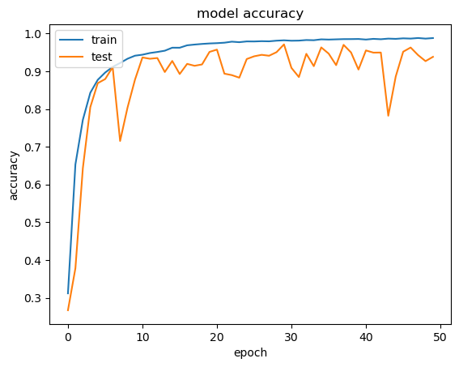
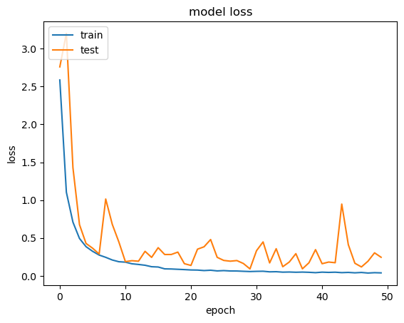

# Densenet-Plant-Disease-Predictor 

This Project aims to provide accurate plant disease predictions built over a DenseNet deep Learning Model with below configurations

input_2 (InputLayer)             [(None, 64, 64, 3)]           0

conv2d (Conv2D)                  (None, 64, 64, 3)             84

densenet121 (Functional)         (None, None, None, 1024       7037504

global_average_pooling2d (       (None, 1024)                  0

GlobalAveragePooling2D)

batch_normalization (Batch       (None, 1024)                  4096

Normalization)

dropout (Dropout)                (None, 1024)                  0

dense (Dense)                    (None, 256)                   262400

batch_normalization_1 (Bat       (None, 256)                   1024

chNormalization)

dropout_1 (Dropout)              (None, 256)                   0

...
Total params: 7308963 (27.88 MB)
Trainable params: 7222755 (27.55 MB)
Non-trainable params: 86208 (336.75 KB) 

# Accuracy achieved through the model is approx 93%

# Prediction Results

